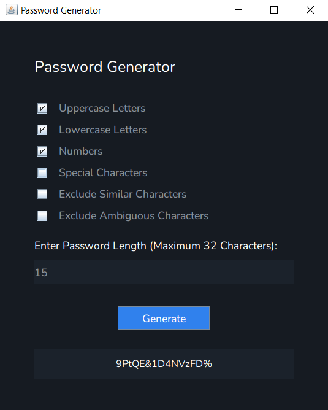

### Password Generator

A simple Password Generator Application built with Java Swing.

#### Features

- Generate passwords with a customizable length (8-20 characters)
- Choose from different character types to include in the generated password
- Option to exclude similar and ambiguous characters for improved readability

#### Screenshot

#### Installation

1. Clone the repository
2. Run the `PasswordGenerator.java` file

#### Usage

1. Select the Character Types to include in the generated password
2. Set the desired Password Length
3. Click the "Generate" button to create a New Password
4. The generated password will be displayed in the Password Label

#### Dependencies

- Java 8 or higher

#### Credits

This project was created by [Aditya Patil](https://github.com/addi1402).

#### License

This project is licensed under the [MIT License](LICENSE).
